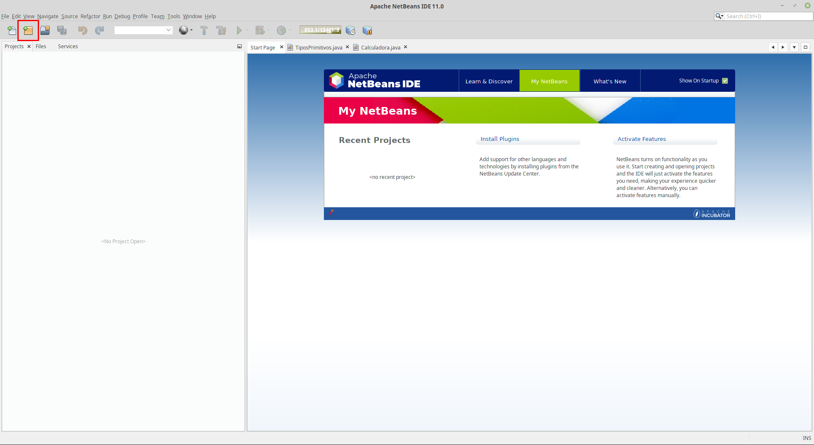
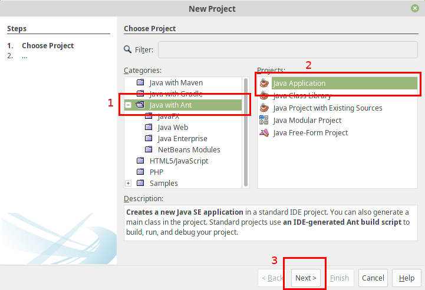
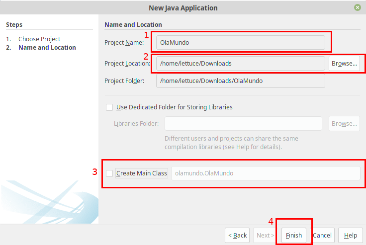
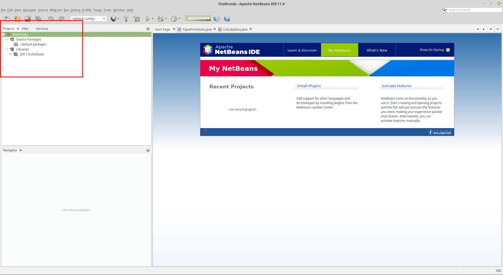
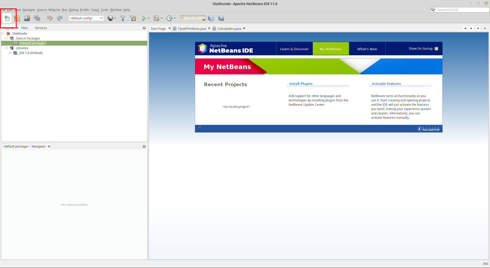
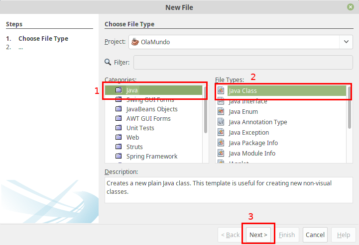
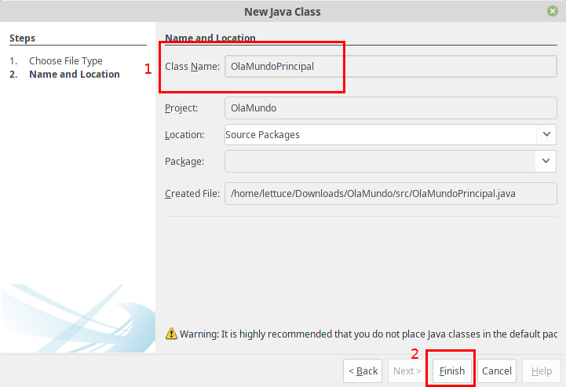
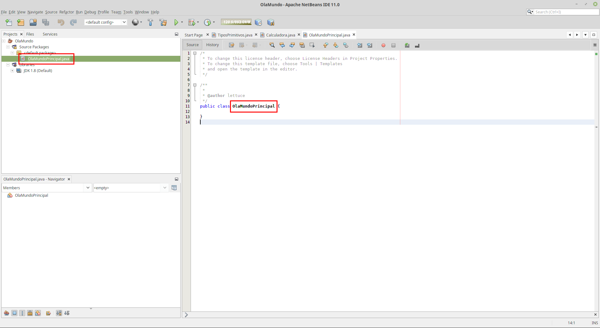
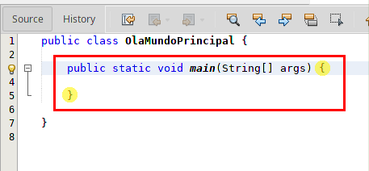
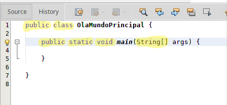

<!-- paginate: false -->

# <!-- fit --> Criar projeto Java Netbeans
Passo a passo

---
<!-- paginate: true -->



---



###### Dependendo da versão, "Java with Ant" ou "Java"

---



---



---

# <!-- fit --> Criar classe Java Netbeans
Passo a passo

---



---



---



---



---

# <!-- fit --> Criar função _main_
Sem esta função o programa não irá funcionar.

---


<br />
<br />
<br />
<br />
<br />
###### Em amarelo está o escopo da função.

---


<br />
<br />
<br />
<br />
<br />
###### Por enquanto, vamos ignorar as informações em amarelo.

---

# Atividade

---

- Criar um projeto chamado `OlaMundo1`.
- Criar uma classe chamada `PrincipalOlaMundo1`.

---

- Criar um projeto chamado `OlaMundo2`.
- Criar uma classe chamada `PrincipalOlaMundo2`.
- Ao executar o projeto, mostrar a mensagem:

```text
Do projeto 2, olá.
```